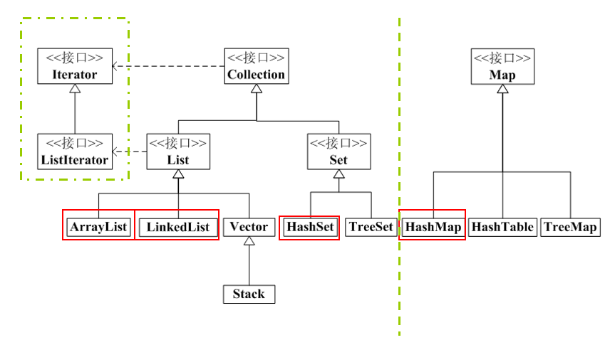

# 123-Java-集合和数组的区别.md

+ 集合概述
    + Java中集合类是用来存放对象的
    + 集合相当于一个容器，里面包容着一组对象  ——  容器类
    + 其中的每个对象作为集合的一个元素出现
    + Java API提供的集合类位于java.util包内
+ Java中数组与集合的比较
    + 数组也是容器，它是定长的，访问较快，但是数组不会自动扩充
    + 数组可以包含基本数据类型或引用类型的对象，而集合中只能包含引用类型的对象
+ Java中集合框架层次结构



1. 为什么要掌握集合?

+ 数组有缺点：
    + 1. 使用之前一定要先初始化，给定长度
    + 2. 数组一旦声明，只能放一种类型的元素
+ 集合的特点：    
    + 1. 集合使用之前也要初始化，但是如果集合存放不下元素的话，集合会自动扩大长度;
    + 2. 集合是一个垃圾桶，什么元素都能放;

**示例代码：**

```
package List集合;

import java.util.ArrayList;
import java.util.List;

public class TestCollection1 {

	public static void main(String[] args) {
		List list = new ArrayList(10);
		list.add("abc");
		list.add(10);
		
		list.add(new Object());
		list.add("abc");
		list.add(10);
		
		list.add(new Object());
		list.add("abc");
		list.add(10);
		
		list.add(new Object());
		list.add("abc");
		list.add(10);
		
		System.out.println(list);
	}
}
```

**以就就是我关于 *Java-集合和数组的区别*  知识点的整理与总结的全部内容，[另附源码](https://github.com/javaobjects/demo516)**

==================================================================
#### 分割线
==================================================================

**博主为咯学编程：父母不同意学编程，现已断绝关系;恋人不同意学编程，现已分手;亲戚不同意学编程，现已断绝来往;老板不同意学编程,现已失业三十年。。。。。。如果此博文有帮到你欢迎打赏，金额不限。。。**

